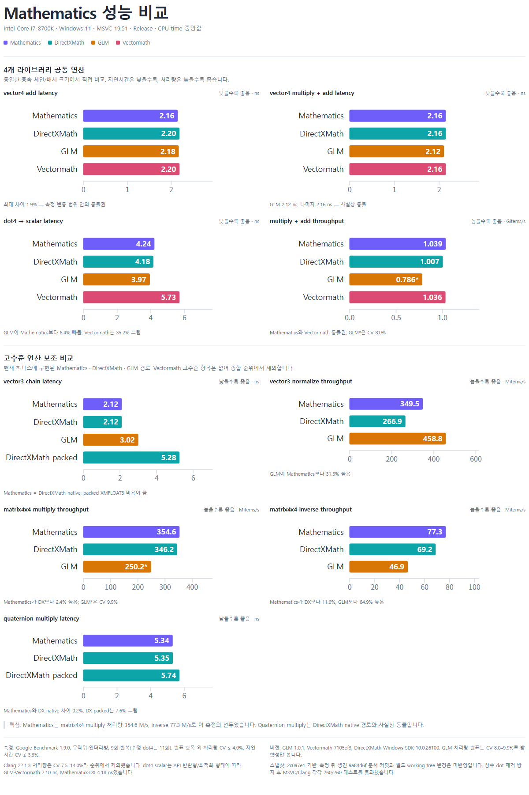

# Mathematics

[](https://github.com/29thnight/mathf/actions/workflows/ci.yml)
[](LICENSE)

DirectXMath급 성능과 예측 가능한 규약을 목표로 하는 C++20/23 게임 수학 라이브러리다.
헤더 온리이며 x64의 SSE2/AVX2, ARM64의 NEON, 이식성 검증을 위한 스칼라 폴백을 지원한다.

> **개발 상태:** Phase 0~5 기능 구현은 완료됐지만 0.1 릴리스 게이트는 아직 미통과다.
> 기하 회귀 3건과 `cross`·행렬 전치·쿼터니언 곱 성능 회귀는 해결됐고, CI가 해당
> 성능 비교와 GCC line coverage 80%를 강제한다. 남은 릴리스 블록은 clang-cl 행렬 곱
> 처리량과 전체 성능 표의 자동화 범위다. 상세 판정은 [PLAN](docs/PLAN.md), 측정치는
> [BASELINE](docs/BASELINE.md)을 기준으로 한다.

> **0.1 API 변경:** 라이브러리 이름은 `Mathematics`, 공개 헤더 경로는
> `<mathematics/...>`, 네임스페이스는 `math`다. 옛 이름을 위한 호환 별칭은 제공하지 않는다.

## 핵심 특징

- `vector2/3/4`, `matrix3x3/4x4`, `quaternion`, `plane`, `ray`, `aabb`, `sphere` 제공
- 벡터·행렬·쿼터니언·TRS·뷰/투영·교차 판정을 하나의 헤더 온리 API로 구성
- 같은 API를 런타임 SIMD 경로와 `constexpr` 상수 평가에서 사용
- DirectXMath 패리티 테스트와 스칼라 참조 테스트로 수치·관례를 교차 검증
- MSVC, clang-cl, GCC, Clang과 x64/ARM64 백엔드를 CI에서 검증
- `std::format` 지원은 `<mathematics/format.hpp>`로 선택적으로 제공

## 빠른 시작

### CMake에 연결

저장소를 프로젝트 안에 배치한 뒤 정본 타깃 `Mathematics::Mathematics`에 링크한다.

```cmake
add_subdirectory(external/mathematics)

target_link_libraries(my_game PRIVATE Mathematics::Mathematics)
target_compile_features(my_game PRIVATE cxx_std_20)
```

`add_subdirectory` 소비자에게는 Mathematics의 테스트·벤치마크·경고 옵션이 전파되지 않는다.

### C++에서 사용

```cpp
#include <mathematics/mathematics.hpp>

const math::vector3 local_position{1.0f, 0.0f, 0.0f};
const math::quaternion rotation = math::quaternion_from_axis_angle(
    math::vector3::unit_y(), math::radians(30.0f));

// 적용 순서: 크기 → 회전 → 이동
const math::matrix4x4 world = math::compose(
    math::vector3::one(), rotation, math::vector3{10.0f, 0.0f, 5.0f});

const math::vector3 world_position =
    math::transform_point(local_position, world);

constexpr math::vector3 x = math::vector3::unit_x();
constexpr math::vector3 y = math::vector3::unit_y();
static_assert(math::cross(x, y) == math::vector3::unit_z());
```

바로 가져다 쓸 수 있는 기능별 예제는
[표현식과 기능 둘러보기](docs/EXPRESSIONS.md)에, 전체 규약과 퇴화 입력 정책은
[사용 가이드](docs/GUIDE.md)에 정리돼 있다.

## API와 수학 관례

### 명명 규칙

| 대상 | 규칙 | 예시 |
|------|------|------|
| 라이브러리·CMake 프로젝트 | `Mathematics` | `project(Mathematics)` |
| CMake 정본 타깃 | `Mathematics::Mathematics` | `target_link_libraries(...)` |
| 공개 헤더 | `mathematics/` | `<mathematics/vector3.hpp>` |
| 네임스페이스 | `math` | `math::vector3` |
| 타입·함수·변수·열거형 값 | `lower_snake_case` | `matrix4x4`, `look_at_lh` |
| 전처리 매크로 | 대문자 접두사 | `MATHEMATICS_FORCE_SCALAR` |

### 좌표와 합성 규약

| 항목 | 규약 |
|------|------|
| 행렬 저장 | row-major, `m[row][column]` |
| 벡터 | 행벡터, `v * m` |
| 합성 순서 | 왼쪽에서 오른쪽, `scale * rotation * translation` |
| 이동 성분 | `matrix4x4`의 3행 |
| 쿼터니언 | `(x, y, z, w)`, 스칼라가 마지막 |
| 쿼터니언 곱 | `a * b`는 `a` 적용 후 `b` 적용 |
| 손잡이 | `_lh`/`_rh` 접미사 필수, 무접미사 기본 함수 없음 |
| 깊이 범위 | Direct3D 방식 `[0, 1]` |
| 각도 | 라디안, `radians()`/`degrees()`로 변환 |

이 규약들은 DirectXMath 결과와 테스트로 고정돼 있다. 특히 행렬·쿼터니언 합성 순서는
일반적인 열벡터 수학 라이브러리와 다를 수 있으므로 이주 전에 [GUIDE](docs/GUIDE.md)를
확인해야 한다.

### 헤더 선택

| 용도 | 헤더 |
|------|------|
| 전체 API | `<mathematics/mathematics.hpp>` |
| 스칼라·각도·삼각함수 | `<mathematics/scalar.hpp>` |
| 벡터 | `<mathematics/vector.hpp>` 또는 개별 `vector2/3/4.hpp` |
| 행렬 | `<mathematics/matrix.hpp>` 또는 개별 `matrix3x3/4x4.hpp` |
| 쿼터니언·변환 | `<mathematics/quaternion.hpp>`, `<mathematics/transform.hpp>` |
| 기하·교차 판정 | `<mathematics/geometry.hpp>` |
| 저수준 레지스터 API | `<mathematics/vec_reg.hpp>` |
| `std::format` | `<mathematics/format.hpp>` |

`format.hpp`는 `<format>`의 컴파일 비용을 사용하지 않는 번역 단위에 부과하지 않도록
우산 헤더에서 의도적으로 제외했다.

## 요구 사항과 지원 환경

- C++20 이상. 지원 컴파일러에서는 자체 타깃을 C++23으로 빌드한다.
- CMake 3.24 이상
- MSVC 19.3x 이상, Clang 15 이상, GCC 12 이상

| 환경 | CI 검증 경로 |
|------|-------------|
| Windows x64 / MSVC | Release, Debug, 스칼라 폴백, SSE2 baseline |
| Windows x64 / clang-cl | Release |
| Linux x64 / GCC·Clang | Release |
| Linux ARM64 / GCC·Clang | NEON Release |

MSVC에서 C++20 모드만 사용하면 `if consteval` 부재로 일부 저수준 연산이 약 2배 느려질
수 있다. 성능이 중요한 MSVC 소비자는 C++23 모드를 권장한다.

## 빌드와 테스트

### Windows 프리셋

Visual Studio 개발자 환경과 CMake 경로는 스크립트가 자동으로 설정한다.

```powershell
scripts\build.bat msvc-release
```

| 프리셋 | 목적 |
|--------|------|
| `msvc-release` | MSVC AVX2/FMA Release |
| `msvc-debug` | MSVC Debug |
| `clang-release` | clang-cl AVX2/FMA Release |
| `scalar-release` | SIMD를 끈 스칼라 폴백 |
| `sse2-release` | SSE4.1/AVX/FMA를 끈 x64 baseline |
| `vs2026-release`, `vs2026-debug` | Visual Studio 솔루션 빌드 |

CMake를 직접 호출할 수도 있다.

```powershell
cmake --preset msvc-release
cmake --build --preset msvc-release
ctest --preset msvc-release
```

Ninja 프리셋 산출물은 OneDrive 동기화 간섭을 피하기 위해
`%LOCALAPPDATA%\MathematicsBuild\<preset>\`에 생성된다.

### Linux

```bash
cmake -S . -B build -DCMAKE_BUILD_TYPE=Release
cmake --build build
ctest --test-dir build --output-on-failure
```

### 감지된 백엔드 확인

빌드된 `mathematics_config_report`는 컴파일러, 언어 표준, 아키텍처와 활성 SIMD 기능을
출력한다.

```powershell
& "$env:LOCALAPPDATA\MathematicsBuild\msvc-release\tools\mathematics_config_report.exe"
```

Linux에서는 `./build/tools/mathematics_config_report`를 실행한다.

### Visual Studio 2026

솔루션을 생성하고 열려면 다음 스크립트를 사용한다.

```powershell
scripts\open_vs.bat
```

생성만 하려면 `scripts\open_vs.bat --no-open`을 사용한다. 솔루션은
`%LOCALAPPDATA%\MathematicsBuild\vs2026\Mathematics.slnx`에 생성되며,
`mathematics_tests`가 시작 프로젝트로 지정된다.

## CMake 옵션

| 옵션 | 기본값 | 설명 |
|------|--------|------|
| `MATHEMATICS_BUILD_TESTS` | 최상위 `ON`, 하위 프로젝트 `OFF` | GoogleTest 테스트 빌드 |
| `MATHEMATICS_BUILD_BENCH` | 최상위 `ON`, 하위 프로젝트 `OFF` | Google Benchmark 빌드 |
| `MATHEMATICS_BUILD_TOOLS` | 최상위 `ON`, 하위 프로젝트 `OFF` | 설정 보고 도구 빌드 |
| `MATHEMATICS_FORCE_SCALAR` | `OFF` | SIMD 대신 스칼라 백엔드 강제 |
| `MATHEMATICS_BASELINE_SSE2` | `OFF` | x86에서 SSE2 경로만 사용 |
| `MATHEMATICS_ENABLE_COVERAGE` | `OFF` | GCC/gcov line coverage 계측 |
| `MATHEMATICS_BENCH_GLM` | `ON` | 벤치마크에 GLM 비교 포함 |
| `MATHEMATICS_BENCH_VECTORMATH` | x86에서 `ON` | 벤치마크에 Vectormath 비교 포함 |

## 검증과 CI 게이트

| 게이트 | 검증 내용 |
|--------|-----------|
| Windows | MSVC Release/Debug, clang-cl Release, scalar, SSE2 baseline |
| Linux x64 | GCC와 Clang 빌드·테스트 |
| Linux ARM64 | GCC와 Clang의 NEON 빌드·테스트 |
| 정확성 | constexpr·스칼라 참조·DirectXMath 패리티 |
| 성능 | MSVC/clang-cl에서 `cross`, 전치, 쿼터니언 곱을 DXMath와 비교 |
| 커버리지 | GCC 활성 코드 line coverage 80% 이상 |

성능 게이트는 후보가 DXMath 기준보다 5% 넘게 느리거나 측정 변동이 지나치게 크면
실패한다. 로컬에서 같은 게이트를 실행하려면 다음 명령을 사용한다.

```powershell
.\scripts\check_performance.ps1 `
    -BenchmarkExe "$env:LOCALAPPDATA\MathematicsBuild\msvc-release\bench\mathematics_bench.exe" `
    -OutputPath "$env:TEMP\mathematics-performance.json"
```

## 대표 성능

아래 도표는 Intel Core i7-8700K, MSVC C++23, AVX2/FMA 환경에서 Mathematics,
DirectXMath, GLM, Vectormath를 같은 하니스로 측정한 결과다. 절대 수치보다 동일
머신·동일 컴파일러에서의 상대 비교를 봐야 한다. 이미지를 누르면 원본 크기로 볼 수 있다.

[](docs/assets/performance-comparison.png)

재현 명령, 전체 표, 컴파일러별 차이와 알려진 clang-cl 행렬 곱 병목은
[BASELINE](docs/BASELINE.md)에 기록돼 있다. 저수준 코드 생성 비교는
[SPIKE-RESULTS](docs/SPIKE-RESULTS.md)를 참조한다.

## 저장소 구조

| 경로 | 내용 |
|------|------|
| `include/mathematics/` | 공개 헤더와 SIMD/상수 평가 백엔드 |
| `tests/` | GoogleTest 정확성·패리티·문서 예제 테스트 |
| `bench/` | Google Benchmark 기반 DXMath/GLM/Vectormath 비교 |
| `spike/` | Phase 0 설계·코드 생성 실험 |
| `scripts/` | 빌드, Visual Studio, 성능 게이트 스크립트 |
| `tools/` | 컴파일 설정·백엔드 보고 도구 |
| `docs/` | 설계 계획, 사용 가이드, 성능 기준선 |

## 문서

- [EXPRESSIONS.md](docs/EXPRESSIONS.md) — 표현식 중심의 기능 소개와 실전 예제
- [GUIDE.md](docs/GUIDE.md) — 관례, 예제, 퇴화 입력 정책, DirectXMath 이주표
- [PLAN.md](docs/PLAN.md) — 설계 결정, Phase 이력, 현재 릴리스 판정
- [BASELINE.md](docs/BASELINE.md) — 성능 기준선과 재현 절차
- [SPIKE-RESULTS.md](docs/SPIKE-RESULTS.md) — constexpr·SIMD 코드 생성 검증

## 라이선스

[MIT License](LICENSE)로 배포한다.
